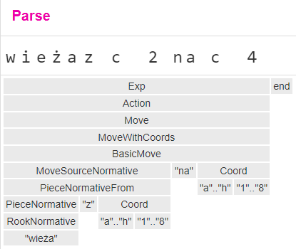

### Demonstration of the use of the Speech Recognition API and the OHM library to create formal grammars for voice control of browser programs & games


## 1. About 
The project I completed allows playing chess with a computer using voice commands in Polish. The entire project was implemented using web technology, meaning the application runs as a website. The main language used to write the application was TypeScript (a superset of JavaScript). The development environment was the Vite toolset, along with the Vitest testing framework. The opponent's moves are generated using the strongest chess engine available at the moment, Stockfish. Running the engine in the browser was made possible by using the engine's image in WebAssembly format - a binary format that allows running programs directly in web browsers, executing them in an isolated environment in the background and enabling bidirectional communication with the JavaScript API via WebWorkers.

## 2. Requirements & Installation & Build

1. Install NodeJS - <https://nodejs.org/en>
2. Activate PNPM manager - <https://pnpm.io/>
3. Download this repository and install dependencies: `pnpm install`
4. Build project: `pnpm run build`
5. Serve webpage on your localhost: `pnpm run preview`

## 3. Presentation of Functionality and Description of Technologies Used
After launching the application and visiting the correct web address, we should see the following start view:


On the left side, we see the PTT (Push to talk) voice input button (the list of voice commands is in the next chapter), which must be **held down** while issuing voice commands (and released after speaking). However, the application can also be used in the traditional way, controlling the pieces and using the button panel on the right side with a mouse.


After the game ends (of course, losing to Stockfish 😊), we have the option to start another game.


## 4. Voice control
In the application, issuing voice commands is done by holding down the microphone button on the left side. On the first attempt, the browser needs permission to use our microphone.


Stan nasłuchu dodatkowo sygnalizowany jest animacją The listening state is additionally indicated by the button animation as follows:


*(not listening on the left, listening on the right)*

## 5. How Speech Recognition Works

Voice command recognition proceeds in the following steps:

1. Pressing the microphone button - WebSpeechAPI starts listening and recognizing speech.
2. Releasing the button immediately stops listening and, if possible, returns possible results.
3. WebSpeechAPI returns a list of the 10 most probable sentences spoken by the user.


4. For each result, an attempt is made to parse the sentence into SAN (Standard Algebraic Notation for chess moves, e.g., Ka4 - king moves to a4), extended with actions and custom commands (e.g., en passant, start - start the game). Parsing is done using the grammar I created in the Ohm format and the Ohm.js library.
5. If one of the sentences is parsed (if several are parsed, the one with the highest confidence score is chosen), the move is validated and executed in the current position, or an action is performed in the current game state.

## 6. Grammar Description

The grammar for parsing sentences was created in the Ohm format. Initially, I created the type for the square, followed by each piece in different cases (nominative, instrumental, and accusative) necessary for subsequent commands. The next step was to create rules for "&lt;piece> from &lt;square>" and "&lt;piece> to &lt;square>", and a move rule as a combination of various possible verbal commands in chess like "rook from c1 to c4", "a4 a5" (pawn moves from a4 to a5), "a4" (pawn from line A moves to a4), etc. Then, I created extensions allowing for captures and piece promotions (on the promotion rank), as well as commands for special moves - castling, en passant capture. The final element was implementing user action rules unrelated to piece movement like "start game", "rematch", "change side", etc.

```js
Chess {
  Exp = Action
  Coord = "a".."h" "1".."8"
  KingNormative = "król"
  KingAccusative = "króla"
  KingAblative = "królem"
  QueenNormative = "królowa" | "dama" | "hetman"
  QueenAccusative = "królową" | "damę" | "hetmana"
  QueenAblative = "królową" | "damą" | "hetmanem"
  KnightNormative = "skoczek" | "koń"
  KnightAccusative = "skoczka" | "konia"
  KnightAblative = "skoczkiem" | "koniem"
  BishopNormative = "goniec" | "laufer"
  BishopAccusative = "gońca" | "laufra"
  BishopAblative = "gońcem" | "laufrem"
  RookNormative = "wieża"
  RookAccusative = "wieżę"
  RookAblative = "wieżą"
  PawnNormative = "pionek" | "pion"
  PawnAccusative = "pionka" | "piona"
  PawnAblative = "pionkiem" | "pionem"
  PieceNormative = KingNormative | QueenNormative | KnightNormative | BishopNormative | RookNormative | PawnNormative
  PieceAccusative = KingAccusative | QueenAccusative | KnightAccusative | BishopAccusative | RookAccusative | PawnAccusative
  PieceAblative = KingAblative | QueenAblative | KnightAblative | BishopAblative | RookAblative | PawnAblative
  PieceNormativeFrom = PieceNormative "z" Coord // skoczek z c4
  PieceAccusativeFrom = PieceAccusative "z" Coord // skoczka z c4
  PieceAblativeFrom = PieceAblative "z" Coord // skoczkiem z c4
  PieceNormativeTo = PieceNormative "na" Coord // skoczek na c4
  PieceAccusativeTo = PieceAccusative "na" Coord // skoczka na c4
  // Complex
  MoveSourceNormative = Coord | PieceNormativeFrom // a1, wieża z a1
  CaptureMove
    = MoveSourceNormative "bije" Coord // a1 bije a4, wieża z a1 bije a4*
    | MoveSourceNormative "bije" PieceAccusativeFrom // a1 bije piona z a4, wieża z a1 bije piona z a4
    | MoveSourceNormative "bije" PieceAccusativeTo // a1 bije piona na a4, wieża z a1 bije piona na a4
  ReCaptureMove = "odbijam" PieceAblativeFrom // odbijam wieżą z c2
  FigureMove = PieceNormative Coord // skoczek c3
  PawnMove = Coord // e4, e5
  BasicMove
    = MoveSourceNormative "" Coord // a2 a4, pion z a2 a4
    | MoveSourceNormative "na" Coord // a2 na a4, pion z a2 na a4
  MoveWithCoords = CaptureMove | BasicMove | PieceNormativeTo | FigureMove | PawnMove | ReCaptureMove // <all above>*
  MoveWithPromotion = MoveWithCoords "z promocją na" PieceAccusative // <all above> z promocją na hetmana
  CaptureEnPassant= "bicie w przelocie"
  CastlingQueenside = "roszada długa" | "roszada hetmańska" | "roszada na skrzydle hetmańskim"
  CastlingKingside = "roszada krótka" | "roszada królewska" | "roszada na skrzydle królewskim"
  Castling = CastlingKingside | CastlingQueenside
  Move = MoveWithPromotion | MoveWithCoords | CaptureEnPassant | Castling
  ActionPlayAsWhite = "graj białymi"
  ActionPlayAsBlack = "graj czarnymi"
  ActionPlayAsOpponentColor = "zmień stronę"
  ActionChangeSide = ActionPlayAsWhite | ActionPlayAsBlack | ActionPlayAsOpponentColor
  ActionStart = "start" | "rozpocznij grę"
  ActionResign = "poddaję się" | "poddaję" | "rezygnuję"
  ActionRematch = "zagrajmy jeszcze raz" | "rewanż"
  Action = ActionChangeSide | ActionStart | ActionResign | ActionRematch | Move
}
```

The grammar in this form allows for breaking down the sentences into a tree structure:



Using the ohm.js library, we can add an attribute or method to each type of node, which allowed us to create a converter that works on the principle of recursion to convert the resulting tree into SAN notation/action notation.

To test the correctness of sentence parsing, I created a list of automated tests aimed at checking whether each possible command is correctly converted into SAN-like notation. The result of running the tests is as follows:


## 7. Bibliography
- <https://developer.mozilla.org/en-US/docs/Web/API/SpeechRecognition>
- <https://ohmjs.org/>
- <https://disservin.github.io/stockfish-docs/stockfish-wiki/UCI-&-Commands.html>
- <https://github.com/lichess-org/chessground>
- <https://www.typescriptlang.org>
- <https://vitejs.dev>
- <https://vitest.dev>
- <https://www.chess.com/computer-chess-championship>
- <https://stockfishchess.org/>
- <https://webassembly.org/>
- <https://developer.mozilla.org/en-US/docs/Web/API/Web_Workers_API>
- <https://en.wikipedia.org/wiki/Algebraic_notation_(chess)> 
- <https://ohmjs.org/> 
